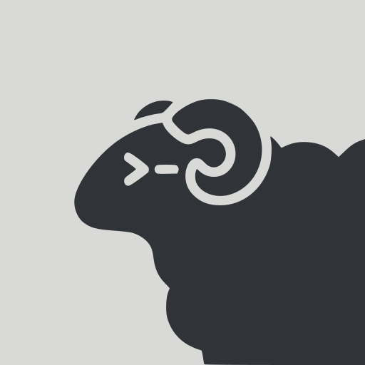

<p align="center"></p>

# Herdr for Nixarchy

A herdr plugin for the Omarchy shell on Nixarchy, based on
[jankeesvw/omarchy-herdr](https://github.com/jankeesvw/omarchy-herdr) (MIT).
The herdr logo is from [herdrdev/herdr](https://github.com/herdrdev/herdr)
(Apache-2.0) and is used to identify herdr.
It starts as that bar widget: how many herdr servers are running, what is
inside each one, and one click to open it.

Herdr runs one server per named session. They are easy to start and they never
stop by themselves, because closing a window detaches rather than ends the
session. So they pile up unseen. This widget puts the count in the bar and the
list one click away.


## What it shows

The bar carries the number of running servers, on a badge sitting in the top
right corner of the icon. It turns red when an agent is blocked and waiting on
an answer, green when work finished while you were looking elsewhere, and amber
while something is still running. When every agent is idle there is nothing to
say, so the badge goes away and the icon stands on its own.

Each row in the panel is one session:

- its name, in bold when a window is already showing it
- the projects open inside it, taken from the workspace labels
- how many agents it holds, and what the most urgent of them is up to
- what every one of those agents is doing, from its terminal title, with its
  own status dot beside it. All of them, however many and wherever herdr keeps
  them: a pane in a second tab counts the same as one sitting in front of you.
  Each of those lines is its own way in
- a dot in the session's colour, taking the state of its loudest agent

## The states

Herdr classifies every agent, and two of those states are the reason to look
at all:

| | | |
|---|---|---|
| **needs you** | red | herdr recognised an approval or a question on screen: that agent is waiting on an answer |
| **done** | green | it finished work you have not seen yet. Focusing the tab turns it back into plain idle |
| working | accent | busy |
| idle | grey | ready for input, and already seen |

Every agent line carries its state as a word, right-aligned in one column down
the edge of the panel, so what the herd is doing is a single glance rather than
a scan. The agents inside a session are ordered by that state rather than by
where they happen to sit - what wants an answer first, then what finished
unseen, then what is busy, then what is only waiting for you to type. That is
herdr's own attention queue, the order its agent panel takes when
`agent_panel_sort = "priority"`. `idle` is written as **ready**, because it is the ordinary resting
state and "idle" reads like a fault.

Both **needs you** and **done** are written bold and in colour, along with the title beside them, and their whole row is washed in that colour: red for a question, green for work that finished. **working** and **ready** stay quiet, because a panel where every line is coloured is a panel where colour means nothing. A dot is something you have to be looking at; a row of colour is something you catch out of the corner of your eye, which is how a pinned panel is read at all. The badge in the bar takes the same colour, so a herd that wants something says so with the panel closed.

Waiting beats finished beats busy, wherever a session has to be summed up in
one colour.

## What it does

- **Click a row** (or `Enter`, or `o`) to open that session. A session shows at
  most one window, because two windows on one session mirror each other, so
  this focuses the window it already has, wherever it is, and only opens a new
  one when there is none. Without a window one is started, in foot.
- **Click one of the agent lines** to land on that agent rather than on
  whatever the session was last showing: its pane is focused inside the server
  first, then the window comes up. That also marks a finished agent as seen, so
  clicking the line that says **done** is what clears it.
- **The skull** (or `k`) ends that server, and is the only way it is ended from
  here. It asks first, and the dialog opens on **Cancel** rather than on the
  confirming side: a dialog that destroys something on a reflexive Enter is
  worse than no dialog, because it trains the reflex. It is the only action in
  the panel that stops to ask - opening, focusing and deleting a stopped
  session are all recoverable or trivial, and this one is not. `herdr session stop` asks over herdr's own socket, so a server too
  wedged to read that socket never hears the request and the button looks
  broken at exactly the moment you needed it. This signals the process instead:
  TERM first, and KILL a second later if that was not enough. The shared
  session is killed like any other, because it wedges like any other.
- **The bin** (or `x`) throws away a session that is already stopped - the
  directory and the state herdr kept in it - which is what clears it out of the
  list for good. It takes the same slot as the skull, because a session is
  never both running and stopped. The shared session is herdr's own and is
  never deleted from here.
- **`r`** refreshes, and so does a middle click on the bar button.
- **The pin** (or `p`) takes the panel out of the bar and leaves it on the desktop. See below.

A row marked **stopped** is a session whose server is not running. The session
itself still exists on disk, under `~/.config/herdr/sessions/<name>/`, which is
why it stays in the list: clicking it starts that server back up, and the bin
throws the session away for good. There is nothing to kill there, so the skull
gives way to the bin.

What survives the server is the layout - herdr keeps it in `session.json` - so
a stopped row still names the workspaces it was holding and the directories
they were opened in, the same names a running session shows. That is the
difference between a session worth starting back up and a name left over from
an afternoon, and it is not something the word "stopped" can tell you. A row
that saved nothing worth naming says **nothing saved**.

The list refreshes every three seconds while the panel is open and every twenty
seconds when it is closed.

## Pinning it

A dropdown is something you open to answer a question and close again. A herd you are running is something you glance at all afternoon, and a panel that shuts the moment you touch anything else cannot be glanced at. So the panel can come loose: click the pin in its header, or press `p`, and the same card carries on as a window of its own, on every workspace, above whatever you are working in, and still one click away from any agent in it.

- **Drag it by the six dots** in the header. Only that strip moves it. The rest of the card is rows and buttons, and those were click targets before the pin existed.
- **Resize it from the corner**, bottom right. A height you set is a height the list lives inside from then on, so the panel keeps the shape you gave it and scrolls rather than growing and shrinking every time an agent turns up or finishes.
- **It remembers where you put it.** Unpinning puts the card back under the bar button; pinning again brings it back to the same place at the same size, because that spot was a decision about your own desktop and re-deciding it on every pin is the panel forgetting something you told it. The first time, with nothing to remember, it opens in the bottom left corner, clear of the bar.
- **The bar button still shows and hides it**, and `Escape` hides it too. Neither of those unpins: only the pin does that.
- **It wears the accent border only while it has the keyboard**, the way every other window on the desktop does. A card that says "focused" all day is saying nothing at all, in the loudest colour the theme has.
- **A pin belongs to one screen.** Every monitor's bar carries its own copy of this widget, so the pinned card appears on the screen you pinned it from and nowhere else.

Position, size and screen are kept in this widget's own entry in `~/.config/omarchy/shell.json`, the same entry the bar's settings screen reads, so there is no config file of its own to keep track of:

```json
{ "id": "nixarchy.herdr", "pinned": true, "pinScreen": "DP-3", "pinX": 54, "pinY": 1404, "pinW": 420, "pinH": 240 }
```

## Screenshots

It follows the theme, so it reads the same on a light one:


The data script has a demo mode, so a screenshot never carries real project
names or agent titles and looks the same in a year:

```bash
bin/herdr-sessions demo on
# ... take the screenshot ...
bin/herdr-sessions demo off
```

Every write is a no-op while it is on, so a click during a shoot cannot kill a
real server.

## Installing it

```bash
omarchy plugin add https://github.com/olafkfreund/nixarchy-herdr
omarchy plugin enable nixarchy.herdr
omarchy bar move nixarchy.herdr --section right
```

Needs `herdr`, `jq` and `hyprctl` on `$PATH`. The last one is what pairs a
session with the window showing it; without Hyprland the list still works, but
every session looks like it has no window and a click opens a new one. `ss`
(from iproute2) is what the skull button uses to find the process behind a
session's socket, and a window is opened in `foot`, falling back to
`xdg-terminal-exec`.

## Removing it

```bash
omarchy plugin disable nixarchy.herdr
omarchy plugin remove nixarchy.herdr
```

The widget keeps no cache of your work: every value on screen is read from
herdr at the moment it is drawn, and nothing about your projects, agents or
titles is ever written to disk.

The one file it can create is the demo flag, and only if you turned demo mode
on. It is empty and holds nothing about you, but it outlives the plugin:

```bash
rm -rf ~/.cache/omarchy-herdr
```

Your herdr sessions are untouched by removing the plugin - they live in
`~/.config/herdr/` and are herdr's, not this widget's.

## License

MIT
